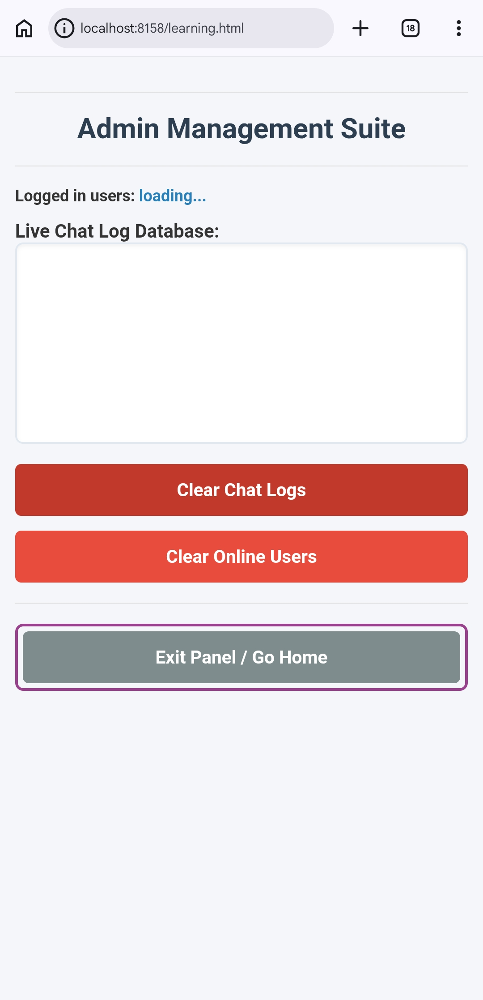

# Friends-Talk
<!--- Short Information --->
<main>
<section>
  <ul>
    <li> Friends-Talk this repo is made for chatting with friends or any one else. Is also have an hosting panel like admin panel from where hoster can delete users and able to clear chats.</li>
    <li>Just <mark>Enter your name</mark> → <mark>Create user</mark> → <mark>Start chatting with your friends</mark></li>
    <li>You have to install <mark><u>MARIADB</u></mark> manualy, don't worry if you don't know how to do it i mention down how to.</li>
  </ul>
</section>
</main>
<!--- Example images --->

<section>
  <h2>Example images:-</h2>
  <figure>
    
    <figcaption>
      This is example page of Friends-Talk home page and how its look after installation.
    </figcaption>
  </figure>
  
  <figure>
    
    <figcaption>
      This is example page of Admin Panel and how its look after installation.
    </figcaption>
  </figure>
  
</section>

<!--- Requirements --->

<section>
  
  <h2>Requirements:-</h2>
  <ul>
    <li>Your <mark>NGROK Auth-token and domain name</mark></li> 
    <li><mark>MARIADB</mark> with friends_talk DATABASE</li>
  </ul>
  
</section>

<!-- installation -->

<section>
  <h2>Installation Proccess:-</h2>
  
  

    
  <table border="3">
    <tr>
      <th>Install Repository</th>
      <th>git clone https://github.com/The-Learner-X/Friends-Talk.git</th>
    </tr>
    <tr>
      <th>change directory</th>
      <th>cd Friends-Talk</th>
    </tr>
    <tr>
      <th>Setup</th>
      <th>bash install.sh</th>
    </tr>
    <tr>
      <th>Start</th>
      <th>CMD:- server</th>
    </tr>
  </table>
  
  

  
  <h2>Mariadb Installation:-</h2>
  
Mariadb is pre installed by this Repo setup, just you have to set manualy same password and react on qu

  

    
  <table border="3">
    <tr>
      <th>check it, is it installed</th>
      <th>1) mariadb-install-db</th>
    </tr>
    <tr>
      <th>socket connection</th>
      <th>2) mysqld --unix-socket=off</th>
    </tr>
    <tr>
      <th colspan="2">Open new terminal</th>
    </tr>
    <tr>
      <th>mariadb setup</th>
      <th>3) mariadb-secure-installation</th>
    </tr>
  </table>
  
  

  <h2>Use following commands to create database and required tables:-</h2>
  
  <ol>
    <li>CREATE DATABASE friends_talk;</li>
    <li>USE friends_talk;</li>
    <li>
    CREATE TABLE users (
    username VARCHAR(50) PRIMARY KEY,
    status VARCHAR(20) DEFAULT 'online',
    last_seen TIMESTAMP DEFAULT CURRENT_TIMESTAMP ON UPDATE CURRENT_TIMESTAMP
    );
    </li>
    <li>
    CREATE TABLE chat_logs (
    id INT AUTO_INCREMENT PRIMARY KEY,
    username VARCHAR(50),
    message TEXT,
    timestamp TIMESTAMP DEFAULT CURRENT_TIMESTAMP
    );
    </li>
  </ol>
  
</section>

<section>
  <h2>Commands you can use to start:-</h2>
  

  <table border="3">
    <tr>
      <th>to start</th>
      <th>Command</th>
    </tr>
    <tr>
      <th>Friends-Talk</th>
      <th>server</th>
    </tr>
    <tr>
      <th rowspan="2">mariadb</th>
      <th>mysqld_safe &</th>
    </tr>
    <tr>
      <th>mariadb -u root -p </th>
    </tr>
  </table>
  

</section>
